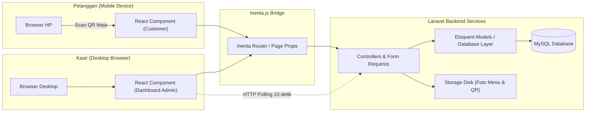

# 📋 Sistem Pemesanan QR Code

[](https://laravel.com)
[](https://react.dev)
[](https://inertiajs.com)
[](https://www.typescriptlang.org)
[](https://tailwindcss.com)
[](LICENSE)


Sistem ini didesain menggunakan arsitektur modern berkinerja tinggi, memadukan keandalan backend **Laravel** dengan keandalan reaktif frontend **React** melalui jembatan **Inertia.js v2**.

---

## ✨ Fitur Utama

### 📱 Sisi Pelanggan (Mobile-First)
- **Menu Digital Tanpa Login:** Pelanggan dapat langsung memesan dengan memindai QR Code unik di setiap meja.
- **Kategori & Pencarian Menu:** Antarmuka intuitif untuk menjelajahi kategori utama, sub-kategori, dan menandai produk *Best Seller*.
- **Kustomisasi Variasi:** Dukungan opsi variasi fleksibel (misal: ukuran, tingkat kemanisan, *extra topping*) yang mempengaruhi harga secara otomatis.
- **Keranjang Belanja Lokal:** Manajemen keranjang belanja langsung di perangkat pelanggan menggunakan *localStorage* terenkripsi ringan.
- **Pembayaran Fleksibel:** Integrasi petunjuk pembayaran manual via **Cash (Tunai)** atau **QRIS Statis**.

### 💻 Sisi Kasir / Admin (Desktop-First)
- **Dashboard Pesanan Real-Time:** Daftar pesanan aktif yang terupdate otomatis setiap 10 detik menggunakan mekanisme polling yang efisien, lengkap dengan notifikasi suara dan visual.
- **Manajemen Pesanan Takeaway:** Input pesanan walk-in secara langsung oleh kasir melalui Point of Sales (POS) bawaan.
- **Konfirmasi Pembayaran Dinamis:** Kalkulator kembalian otomatis untuk pembayaran tunai dan konfirmasi pembayaran QRIS sekali klik.
- **CRUD Menu & Variasi Komprehensif:** Kelola produk, gambar, kategori, ketersediaan stok, diskon per item, hingga opsi variasi dengan mudah.
- **Manajemen Meja & Generator QR:** Generate QR Code dinamis untuk meja baru secara instan, lengkap dengan opsi unduh QR beresolusi tinggi.
- **Laporan Penjualan Visual:** Laporan penjualan harian, mingguan, bulanan, statistik pendapatan, dan ranking menu terlaris menggunakan grafik interaktif.

---

## 🛠️ Tech Stack & Arsitektur

Aplikasi ini dibangun menggunakan kombinasi teknologi terbaik di kelasnya untuk memberikan performa maksimal dan efisiensi pengembangan:

- **Backend:** Laravel 12 (PHP 8.2+) dengan Eloquent ORM.
- **Frontend:** React 18 & TypeScript (Type Safety terjamin).
- **Jembatan SPA:** Inertia.js 2.x (menghubungkan Laravel & React tanpa kerumitan API REST/GraphQL).
- **Styling & UI:** Tailwind CSS & shadcn/ui (berbasis Radix UI yang aksesibel).
- **Database:** MySQL 8.x.
- **Package Manager & Runtime:** Bun (kinerja cepat untuk eksekusi skrip frontend).
- **Visualisasi Data:** Recharts (grafik laporan).
- **QR Code Generator:** `chillerlan/php-qrcode`.

### Arsitektur Aliran Data



---

## 🚀 Panduan Instalasi & Pengaturan

Ikuti langkah-langkah berikut untuk menjalankan proyek di komputer lokal Anda:

### Prasyarat
Pastikan Anda sudah menginstal alat-alat berikut:
- PHP >= 8.2
- Composer
- Node.js / Bun (Sangat direkomendasikan menggunakan Bun)
- MySQL Server

### Langkah-langkah Pengaturan

1. **Kloning Repositori:**
   ```bash
   git clone https://github.com/checamaulana/sistem-pemesanan-qr.git
   cd sistem-pemesanan-qr
   ```

2. **Instal Dependensi Backend (PHP):**
   ```bash
   composer install
   ```

3. **Instal Dependensi Frontend (JavaScript/TypeScript):**
   Menggunakan Bun:
   ```bash
   bun install
   ```
   Atau menggunakan NPM:
   ```bash
   npm install
   ```

4. **Konfigurasi Lingkungan (`.env`):**
   Salin file konfigurasi contoh dan buat file `.env` baru:
   ```bash
   cp .env.example .env
   ```
   Buka file `.env` dan sesuaikan pengaturan koneksi database Anda:
   ```env
   DB_CONNECTION=mysql
   DB_HOST=127.0.0.1
   DB_PORT=3306
   DB_DATABASE=kopi_tempo
   DB_USERNAME=root
   DB_PASSWORD=
   ```

5. **Generate Application Key:**
   ```bash
   php artisan key:generate
   ```

6. **Jalankan Migrasi Database & Seeder:**
   Perintah ini akan membuat semua tabel yang dibutuhkan beserta akun admin default dan data menu awal:
   ```bash
   php artisan migrate --seed
   ```

7. **Hubungkan Storage:**
   Buat symbolic link agar file gambar menu dan QR code dapat diakses oleh publik:
   ```bash
   php artisan storage:link
   ```

8. **Jalankan Server:**
   Jalankan server backend Laravel (di terminal pertama):
   ```bash
   php artisan serve
   ```
   Jalankan server pengembangan frontend (di terminal kedua):
   Menggunakan Bun:
   ```bash
   bun run dev
   ```
   Atau menggunakan NPM:
   ```bash
   npm run dev
   ```

---

## 🔑 Kredensial Login Default

Gunakan kredensial berikut untuk masuk ke dashboard kasir setelah melakukan seeder database:
- **Halaman Login:** `http://localhost:8000/login`
- **Username:** `admin`
- **Password:** `password`

Untuk mengakses menu pelanggan, simulasikan pemindaian QR Code meja dengan membuka URL berikut di browser Anda:
- `http://localhost:8000/meja/1/menu` (untuk Meja nomor 1)

---

## 🧪 Pengujian (Testing)

Aplikasi ini dilengkapi dengan suite pengujian komprehensif menggunakan **Pest PHP** untuk memastikan keandalan alur bisnis pemesanan:

Jalankan semua pengujian dengan perintah:
```bash
php artisan test
```

---

## 📄 Lisensi

Proyek ini dilisensikan di bawah lisensi MIT. Lihat file [LICENSE](LICENSE) untuk informasi lebih lanjut.
