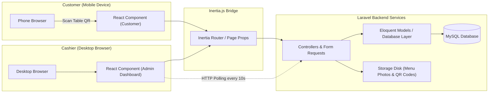

# Ordio - QR Code Ordering System

[](https://laravel.com)
[](https://react.dev)
[](https://inertiajs.com)
[](https://www.typescriptlang.org)
[](https://tailwindcss.com)
[](LICENSE)

**Ordio** is a QR code ordering system for restaurants and cafés. It runs a **Laravel** backend and a **React** frontend through the **Inertia.js v2** bridge. Customers order from their phones without installing anything. Staff run the floor from one dashboard.

---

## 📖 Table of Contents

- [Key Features](#-key-features)
- [Tech Stack & Architecture](#️-tech-stack--architecture)
- [Data Flow Architecture](#data-flow-architecture)
- [Installation Guide](#-installation-guide)
- [Default Login Credentials](#-default-login-credentials)
- [Testing](#-testing)
- [License](#-license)

---

## ✨ Key Features

### 📱 Customer Side (Mobile-First)
- **No login required.** Customers scan the QR code at their table and start ordering.
- **Menu categories and search.** Browse main categories, subcategories, and Best Seller picks.
- **Flexible variations.** Pick size, sweetness level, or extra toppings, and the price updates to match.
- **Local shopping cart.** The cart lives on the customer's device, in encrypted localStorage.
- **Flexible payment.** Pay with Cash or Static QRIS, with clear instructions for either method.

### 💻 Cashier / Admin Side (Desktop-First)
- **Real-time order dashboard.** The active order list refreshes every 10 seconds through polling, with sound and visual alerts for new orders.
- **Takeaway order management.** Cashiers enter walk-in orders through the built-in point of sale.
- **Dynamic payment confirmation.** The system calculates change for cash payments and confirms QRIS payments in one click.
- **Menu and variation CRUD.** Manage products, images, categories, stock, per-item discounts, and variation options from one screen.
- **Table management and QR generator.** Generate a QR code for a new table and download it in high resolution.
- **Visual sales reports.** Track sales, revenue, and best-selling items by day, week, or month on interactive charts.

---

## 🛠️ Tech Stack & Architecture

| Layer | Technology |
|---|---|
| **Backend** | Laravel 12 (PHP 8.2+) with Eloquent ORM |
| **Frontend** | React 18 & TypeScript |
| **SPA Bridge** | Inertia.js 2.x (connects Laravel and React without a separate REST/GraphQL API) |
| **Styling & UI** | Tailwind CSS & shadcn/ui (built on Radix UI primitives) |
| **Database** | MySQL 8.x |
| **Package Manager & Runtime** | Bun |
| **Data Visualization** | Recharts |
| **QR Code Generator** | `chillerlan/php-qrcode` |

### Data Flow Architecture



---

## 🚀 Installation Guide

Follow these steps to run Ordio on your local machine.

### Prerequisites
Install the following before you start:
- PHP >= 8.2
- Composer
- Node.js / Bun (Bun is recommended)
- MySQL Server

### Setup Steps

1. **Clone the repository:**
   ```bash
   git clone https://github.com/yourusername/ordio.git
   cd ordio
   ```

2. **Install backend dependencies (PHP):**
   ```bash
   composer install
   ```

3. **Install frontend dependencies (JavaScript/TypeScript):**
   Using Bun:
   ```bash
   bun install
   ```
   Or using NPM:
   ```bash
   npm install
   ```

4. **Configure the environment (`.env`):**
   Copy the example config file to create a new `.env` file:
   ```bash
   cp .env.example .env
   ```
   Open `.env` and set your database connection:
   ```env
   DB_CONNECTION=mysql
   DB_HOST=127.0.0.1
   DB_PORT=3306
   DB_DATABASE=ordio
   DB_USERNAME=root
   DB_PASSWORD=
   ```

5. **Generate the application key:**
   ```bash
   php artisan key:generate
   ```

6. **Run database migrations and seeders:**
   This creates the required tables plus a default admin account and starter menu data:
   ```bash
   php artisan migrate --seed
   ```

7. **Link storage:**
   Create a symbolic link so menu images and QR codes are publicly accessible:
   ```bash
   php artisan storage:link
   ```

8. **Start the servers:**
   Run the Laravel backend (first terminal):
   ```bash
   php artisan serve
   ```
   Run the frontend dev server (second terminal):
   Using Bun:
   ```bash
   bun run dev
   ```
   Or using NPM:
   ```bash
   npm run dev
   ```

---

## 🔑 Default Login Credentials

Use these credentials to log in to the cashier dashboard after seeding the database:
- **Login page:** `http://localhost:8000/login`
- **Username:** `admin`
- **Password:** `password`

> ⚠️ Change these credentials before you deploy to production.

To view the customer menu, simulate a table QR scan by opening this URL in your browser:
- `http://localhost:8000/meja/1/menu` (for Table No. 1)

---

## 🧪 Testing

Ordio uses **Pest PHP** to test the core ordering workflows.

Run the full suite with:
```bash
php artisan test
```

---

## 📄 License

This project is licensed under the MIT License. See [LICENSE](LICENSE) for details.
