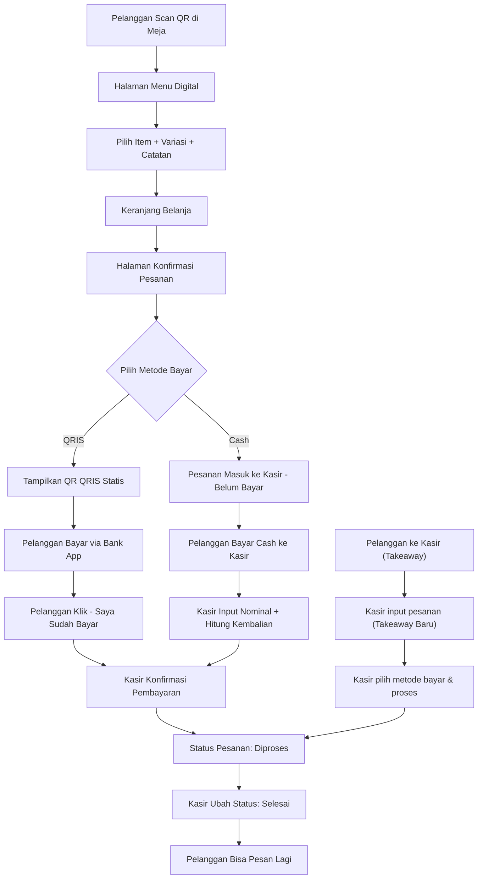
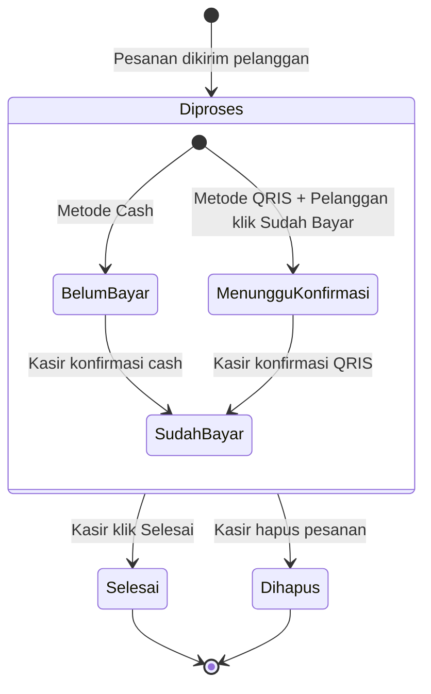

# 🔄 Application Flow
# Sistem Pemesanan QR Code — Kopi Tempo

---

## 1. Ringkasan Alur Sistem



---

## 2. Alur Pelanggan (Customer Flow)

### 2.1 Scan QR Code & Akses Menu

```
1. Pelanggan duduk di meja
2. Pelanggan scan QR Code yang ada di meja menggunakan kamera HP
3. Browser HP terbuka → mengarah ke URL: /meja/{nomor_meja}/menu
4. Sistem mendeteksi nomor meja dari URL
5. Halaman menu digital ditampilkan dengan header "Meja {nomor_meja}"
```

**Kondisi Error:**
- Jika meja tidak ditemukan (QR invalid) → tampilkan halaman error "Meja tidak ditemukan"
- Jika meja sudah dihapus → tampilkan halaman error "Meja tidak tersedia"

### 2.2 Melihat Menu

```
1. Pelanggan melihat daftar menu yang dikelompokkan per kategori & sub-kategori
2. Item yang statusnya "Habis" tetap ditampilkan tapi TIDAK bisa dipilih (grayed out)
3. Item dengan label "Best Seller" ditandai dengan badge khusus
4. Item dengan diskon aktif menampilkan harga asli (coret) dan harga setelah diskon
5. Setiap item menampilkan: Foto, Nama, Harga
6. Pelanggan bisa scroll dan berpindah antar kategori
```

### 2.3 Memilih Item & Menambahkan ke Keranjang

```
1. Pelanggan tap pada item menu
2. Modal/sheet detail item muncul:
   a. Foto item (besar)
   b. Nama item
   c. Harga dasar
   d. Pilihan variasi (jika ada) — wajib dipilih jika ada
      - Misal: Ukuran → S / M / L (masing-masing dengan tambahan harga)
      - Misal: Level Gula → Normal / Less / No Sugar
   e. Input catatan khusus (textarea, opsional)
   f. Selector jumlah (+ / -)
   g. Harga total item (harga dasar + variasi × jumlah)
3. Pelanggan tap "Tambah ke Keranjang"
4. Item ditambahkan ke keranjang
5. Badge jumlah item muncul di ikon keranjang (floating button)
6. Pelanggan kembali ke halaman menu, bisa tambah item lain
```

### 2.4 Review Keranjang

```
1. Pelanggan tap ikon keranjang (floating button)
2. Halaman/sheet keranjang muncul, menampilkan:
   a. Daftar item yang dipilih:
      - Nama item
      - Variasi yang dipilih
      - Catatan (jika ada)
      - Jumlah
      - Harga per item (sudah termasuk variasi)
   b. Pelanggan bisa:
      - Mengubah jumlah item (+ / -)
      - Menghapus item dari keranjang
   c. Ringkasan harga:
      - Subtotal (sebelum pajak)
      - Diskon (jika ada item dengan diskon aktif)
      - Pajak (11%)
      - Total
3. Pelanggan tap "Lanjut ke Pembayaran"
```

### 2.5 Halaman Konfirmasi & Pilih Metode Bayar

```
1. Halaman konfirmasi menampilkan:
   a. Ringkasan pesanan final (read-only)
   b. Nomor meja
   c. Breakdown harga (Subtotal, Diskon, Pajak 11%, Total)
   d. Pilihan metode pembayaran:
      - [ ] Cash (Bayar di Kasir)
      - [ ] QRIS (Bayar Digital)
2. Pelanggan memilih salah satu metode bayar
3. Pelanggan tap "Kirim Pesanan"
```

### 2.6 Alur Setelah Kirim Pesanan — Cash

```
1. Pesanan dikirim ke server
2. Server menyimpan pesanan dengan:
   - Status pesanan: "Diproses"
   - Status pembayaran: "Belum Bayar"
   - Metode: "Cash"
3. Pelanggan melihat halaman sukses:
   - "Pesanan Anda telah dikirim!"
   - "Silakan menuju kasir untuk melakukan pembayaran"
   - Nomor pesanan ditampilkan
4. Pelanggan pergi ke kasir untuk bayar secara fisik
```

### 2.7 Alur Setelah Kirim Pesanan — QRIS

```
1. Pesanan dikirim ke server
2. Server menyimpan pesanan dengan:
   - Status pesanan: "Diproses"
   - Status pembayaran: "Menunggu Konfirmasi"
   - Metode: "QRIS"
3. Pelanggan melihat halaman pembayaran QRIS:
   - Gambar QR QRIS statis milik cafe ditampilkan
   - Total yang harus dibayar
   - Instruksi: "Scan QR di atas menggunakan aplikasi bank/e-wallet Anda"
   - Tombol: "Saya Sudah Bayar"
4. Pelanggan scan QRIS dan bayar di aplikasi bank
5. Pelanggan tap "Saya Sudah Bayar"
6. Halaman berubah menjadi:
   - "Pembayaran sedang diverifikasi oleh kasir"
   - "Mohon tunggu konfirmasi"
7. Selesai — pelanggan menunggu pesanan datang
```

### 2.8 Pesan Lagi (Multi-Order)

```
1. Setelah pesanan sebelumnya sudah dibayar (status: "Sudah Bayar"):
   - Pelanggan bisa scan QR lagi atau akses URL menu yang sama
   - Pelanggan bisa memesan lagi dari awal
2. Jika pesanan sebelumnya BELUM dibayar:
   - Pelanggan diarahkan ke halaman yang menginformasikan:
     "Anda memiliki pesanan yang belum dibayar. Silakan selesaikan pembayaran terlebih dahulu."
   - Pelanggan tidak bisa membuat pesanan baru
```

---

## 3. Alur Kasir / Admin (Cashier Flow)

### 3.1 Login

```
1. Kasir mengakses URL: /login
2. Halaman login menampilkan:
   - Input username
   - Input password
   - Tombol "Masuk"
3. Kasir memasukkan credentials → klik "Masuk"
4. Jika berhasil → redirect ke /dashboard
5. Jika gagal → tampilkan pesan error "Username atau password salah"
```

### 3.2 Dashboard — Pesanan Aktif

```
1. Kasir melihat halaman utama dashboard
2. Dashboard menampilkan daftar pesanan dengan status "Diproses" serta tombol **"Takeaway Baru"**
3. Setiap kartu pesanan menampilkan:
   - Nomor pesanan
   - Detail area (Meja X / Takeaway)
   - Badge tipe order (Dine-in / Takeaway)
   - Waktu pesanan masuk
   - Daftar item (nama, variasi, jumlah, catatan)
   - Total harga
   - Metode pembayaran (Cash / QRIS)
   - Status pembayaran (Belum Bayar / Menunggu Konfirmasi / Sudah Bayar)
4. Data di-refresh otomatis setiap 10 detik (polling)
5. Ketika ada pesanan baru:
   - Suara notifikasi berbunyi
   - Pop-up notifikasi muncul di browser
```

### 3.2.1 Input Pesanan Takeaway Baru

```
1. Pelanggan memesan langsung di kasir untuk Takeaway
2. Kasir klik tombol "Takeaway Baru"
3. Tampil halaman katalog menu mirip tampilan pelanggan
4. Kasir tap item menu, pilih variasi, jumlah, dan catat keranjang
5. Kasir proses "Checkout" dan pilih metode bayar
6. Kasir langsung konfirmasi proses pembayaran (seperti Cash/QRIS flow)
7. Pesanan masuk ke Dashboard dengan tipe=Takeaway dan nomor meja="-"
```

### 3.3 Proses Pembayaran Cash (di Dashboard)

```
1. Kasir melihat pesanan dengan metode "Cash" dan status "Belum Bayar"
2. Pelanggan datang ke kasir untuk bayar
3. Kasir klik "Proses Pembayaran" pada pesanan tersebut
4. Modal pembayaran muncul:
   - Total yang harus dibayar (sudah termasuk pajak & diskon)
   - Input: Nominal uang yang diterima
   - Kalkulasi otomatis: Kembalian = Uang diterima - Total
5. Kasir input nominal → klik "Konfirmasi Pembayaran"
6. Status pembayaran berubah menjadi "Sudah Bayar"
```

### 3.4 Proses Pembayaran QRIS (di Dashboard)

```
1. Kasir melihat pesanan dengan metode "QRIS" dan status "Menunggu Konfirmasi"
   (Artinya pelanggan sudah klik "Saya Sudah Bayar" di HP-nya)
2. Kasir memverifikasi pembayaran di aplikasi bank / rekening cafe
3. Kasir klik "Konfirmasi Pembayaran" pada pesanan tersebut
4. Status pembayaran berubah menjadi "Sudah Bayar"
```

### 3.5 Ubah Status Pesanan

```
1. Kasir melihat pesanan yang sudah "Sudah Bayar"
2. Kasir menyampaikan pesanan ke dapur secara MANUAL (di luar sistem)
3. Setelah pesanan selesai disajikan, kasir klik "Selesai"
4. Status pesanan berubah: Diproses → Selesai
5. Pesanan hilang dari daftar pesanan aktif
```

### 3.6 Hapus Pesanan

```
1. Kasir bisa menghapus pesanan kapan saja
2. Kasir klik tombol "Hapus" pada pesanan
3. Konfirmasi dialog muncul: "Yakin ingin menghapus pesanan ini?"
4. Jika ya → pesanan dihapus dari sistem
```

### 3.7 Manajemen Menu

#### CRUD Kategori & Sub-kategori

```
1. Kasir navigasi ke halaman "Kelola Menu" → tab "Kategori"
2. Kasir bisa:
   - Tambah kategori baru (input nama)
   - Edit nama kategori
   - Hapus kategori (hanya jika tidak ada item di dalamnya)
   - Tambah sub-kategori di bawah kategori tertentu
   - Edit sub-kategori
   - Hapus sub-kategori (hanya jika tidak ada item di dalamnya)
```

#### CRUD Item Menu

```
1. Kasir navigasi ke halaman "Kelola Menu" → tab "Item Menu"
2. Daftar item menu ditampilkan
3. Tambah item baru:
   - Input: Nama (wajib)
   - Input: Harga (wajib, dalam Rupiah)
   - Upload: Foto (wajib)
   - Select: Kategori (wajib)
   - Select: Sub-kategori (opsional)
   - Toggle: Best Seller (default: off)
   - Toggle: Diskon (default: off)
     - Jika on → input nominal/persentase diskon
   - Tombol: "Simpan"
4. Edit item: Form yang sama, pre-filled dengan data existing
5. Hapus item: Dengan konfirmasi dialog
```

#### CRUD Variasi Menu

```
1. Kasir masuk ke detail item menu
2. Section "Variasi" ditampilkan
3. Tambah Grup Variasi:
   - Input: Nama grup (misal: "Ukuran")
   - Tambah Opsi:
     - Input: Nama opsi (misal: "Large")
     - Input: Tambahan harga (misal: +5000)
   - Bisa tambah banyak opsi per grup
4. Bisa tambah banyak grup variasi per item
5. Edit & hapus grup variasi / opsi variasi
```

#### Toggle Status Menu

```
1. Di daftar item menu, setiap item memiliki toggle:
   - Ketersediaan: Tersedia ↔ Habis
   - Best Seller: On ↔ Off
   - Diskon: On ↔ Off
2. Toggle langsung berlaku tanpa perlu save
```

### 3.8 Manajemen Meja

```
1. Kasir navigasi ke halaman "Kelola Meja"
2. Daftar meja ditampilkan (tabel biasa):
   - Nomor meja
   - Status (Kosong / Terisi)
   - Tombol: Lihat QR | Tutup Meja | Hapus
3. Tambah meja:
   - Kasir klik "Tambah Meja"
   - Input: Nomor meja
   - QR Code otomatis di-generate setelah meja dibuat
   - QR Code mengarah ke URL: /meja/{nomor_meja}/menu
4. Lihat QR:
   - QR Code ditampilkan di modal
   - Kasir bisa download gambar QR (untuk dicetak)
5. Tutup Meja:
   - Reset status meja dari "Terisi" menjadi "Kosong"
   - Semua sesi pesanan di meja tersebut dianggap selesai
6. Hapus Meja:
   - Meja dihapus dari sistem
   - Hanya bisa dihapus jika status "Kosong"
   - Konfirmasi dialog sebelum hapus
```

### 3.9 Laporan

```
1. Kasir navigasi ke halaman "Laporan"
2. Tersedia beberapa tab/section:

   a. Penjualan Harian:
      - Pilih tanggal
      - Tampilkan total penjualan, jumlah transaksi, daftar pesanan hari itu

   b. Penjualan Mingguan:
      - Pilih minggu
      - Tampilkan grafik penjualan per hari dalam seminggu
      - Total penjualan minggu tersebut

   c. Penjualan Bulanan:
      - Pilih bulan & tahun
      - Tampilkan grafik penjualan per hari/minggu dalam sebulan
      - Total penjualan bulan tersebut

   d. Item Terlaris:
      - Pilih periode (hari/minggu/bulan)
      - Ranking item berdasarkan jumlah terjual
      - Tampilkan: Nama item, jumlah terjual, total pendapatan per item

   e. Pendapatan:
      - Pilih periode custom (dari tanggal - sampai tanggal)
      - Total pendapatan dalam periode tersebut
      - Breakdown per metode pembayaran (Cash vs QRIS)
```

### 3.10 Logout

```
1. Kasir klik tombol "Keluar" di sidebar/header
2. Sesi dihapus
3. Redirect ke halaman login
```

---

## 4. Navigasi Dashboard Kasir

```
Sidebar / Top Navigation:
├── Dashboard (Pesanan Aktif)
│   └── Buat Takeaway Baru  (Button)
├── Kelola Menu
│   ├── Item Menu
│   └── Kategori
├── Kelola Meja
├── Laporan
│   ├── Penjualan Harian
│   ├── Penjualan Mingguan
│   ├── Penjualan Bulanan
│   ├── Item Terlaris
│   └── Pendapatan
└── Keluar
```

---

## 5. Halaman Pelanggan (Mobile)

```
Halaman-halaman yang diakses pelanggan:
├── /meja/{nomor}/menu          → Halaman menu digital
├── /meja/{nomor}/keranjang     → Halaman keranjang (bisa juga sebagai sheet/modal)
├── /meja/{nomor}/checkout      → Halaman konfirmasi + pilih metode bayar
├── /meja/{nomor}/pembayaran    → Halaman pembayaran QRIS (jika pilih QRIS)
├── /meja/{nomor}/sukses        → Halaman sukses pesanan terkirim
└── /meja/{nomor}/belum-bayar   → Halaman info pesanan belum dibayar
```

---

## 6. Diagram Status Pesanan & Pembayaran


