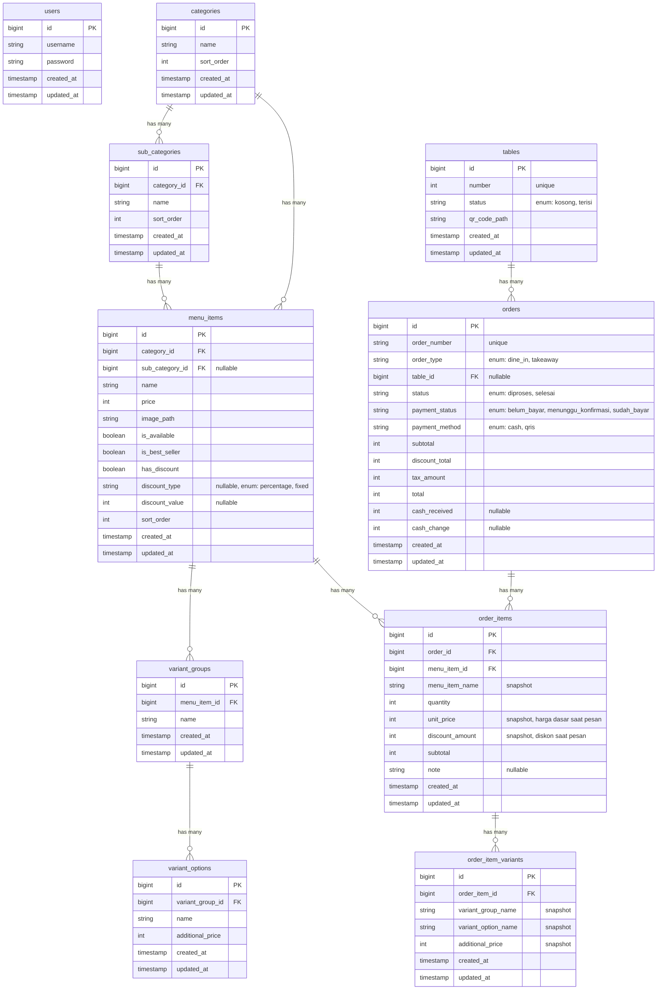

# 🏗️ Backend Structure
# Sistem Pemesanan QR Code — Kopi Tempo

---

## 1. Struktur Folder Laravel

```
app/
├── Http/
│   ├── Controllers/
│   │   ├── Auth/
│   │   │   └── LoginController.php
│   │   ├── Customer/
│   │   │   ├── MenuController.php
│   │   │   └── OrderController.php
│   │   └── Dashboard/
│   │       ├── DashboardController.php
│   │       ├── MenuItemController.php
│   │       ├── CategoryController.php
│   │       ├── SubCategoryController.php
│   │       ├── VariantGroupController.php
│   │       ├── VariantOptionController.php
│   │       ├── TableController.php
│   │       ├── OrderController.php
│   │       ├── PaymentController.php
│   │       └── ReportController.php
│   ├── Middleware/
│   │   └── HandleInertiaRequests.php
│   └── Requests/
│       ├── Auth/
│       │   └── LoginRequest.php
│       ├── Customer/
│       │   └── StoreOrderRequest.php
│       └── Dashboard/
│           ├── StoreMenuItemRequest.php
│           ├── UpdateMenuItemRequest.php
│           ├── StoreCategoryRequest.php
│           ├── StoreSubCategoryRequest.php
│           ├── StoreVariantGroupRequest.php
│           ├── StoreVariantOptionRequest.php
│           ├── StoreTableRequest.php
│           └── ProcessPaymentRequest.php
├── Models/
│   ├── User.php
│   ├── Category.php
│   ├── SubCategory.php
│   ├── MenuItem.php
│   ├── VariantGroup.php
│   ├── VariantOption.php
│   ├── Table.php
│   ├── Order.php
│   ├── OrderItem.php
│   └── OrderItemVariant.php
├── Services/
│   ├── OrderService.php
│   ├── PaymentService.php
│   ├── QrCodeService.php
│   └── ReportService.php
├── Enums/
│   ├── OrderStatus.php
│   ├── PaymentStatus.php
│   ├── PaymentMethod.php
│   ├── DiscountType.php
│   └── TableStatus.php
database/
├── migrations/
│   ├── 0001_create_users_table.php
│   ├── 0002_create_categories_table.php
│   ├── 0003_create_sub_categories_table.php
│   ├── 0004_create_menu_items_table.php
│   ├── 0005_create_variant_groups_table.php
│   ├── 0006_create_variant_options_table.php
│   ├── 0007_create_tables_table.php
│   ├── 0008_create_orders_table.php
│   ├── 0009_create_order_items_table.php
│   └── 0010_create_order_item_variants_table.php
├── seeders/
│   ├── DatabaseSeeder.php
│   ├── UserSeeder.php
│   └── TableSeeder.php
routes/
├── web.php                         # Semua routes (auth + customer + dashboard)
storage/
├── app/
│   └── public/
│       ├── menu/                   # Foto menu items
│       └── qrcodes/                # QR Code images per meja
public/
├── sounds/
│   └── notification.mp3            # Suara notifikasi pesanan baru
└── images/
    └── qris.png                    # Gambar QRIS statis milik cafe
```

---

## 2. Database Schema

### 2.1 Entity-Relationship Diagram



### 2.2 Detail Tabel

#### `users`
```sql
CREATE TABLE users (
    id BIGINT UNSIGNED AUTO_INCREMENT PRIMARY KEY,
    username VARCHAR(255) UNIQUE NOT NULL,
    password VARCHAR(255) NOT NULL,
    created_at TIMESTAMP NULL,
    updated_at TIMESTAMP NULL
);
```

#### `categories`
```sql
CREATE TABLE categories (
    id BIGINT UNSIGNED AUTO_INCREMENT PRIMARY KEY,
    name VARCHAR(255) NOT NULL,
    sort_order INT DEFAULT 0,
    created_at TIMESTAMP NULL,
    updated_at TIMESTAMP NULL
);
```

#### `sub_categories`
```sql
CREATE TABLE sub_categories (
    id BIGINT UNSIGNED AUTO_INCREMENT PRIMARY KEY,
    category_id BIGINT UNSIGNED NOT NULL,
    name VARCHAR(255) NOT NULL,
    sort_order INT DEFAULT 0,
    created_at TIMESTAMP NULL,
    updated_at TIMESTAMP NULL,
    FOREIGN KEY (category_id) REFERENCES categories(id) ON DELETE RESTRICT
);
```

#### `menu_items`
```sql
CREATE TABLE menu_items (
    id BIGINT UNSIGNED AUTO_INCREMENT PRIMARY KEY,
    category_id BIGINT UNSIGNED NOT NULL,
    sub_category_id BIGINT UNSIGNED NULL,
    name VARCHAR(255) NOT NULL,
    price INT UNSIGNED NOT NULL,
    image_path VARCHAR(500) NOT NULL,
    is_available BOOLEAN DEFAULT TRUE,
    is_best_seller BOOLEAN DEFAULT FALSE,
    has_discount BOOLEAN DEFAULT FALSE,
    discount_type ENUM('percentage', 'fixed') NULL,
    discount_value INT UNSIGNED NULL,
    sort_order INT DEFAULT 0,
    created_at TIMESTAMP NULL,
    updated_at TIMESTAMP NULL,
    FOREIGN KEY (category_id) REFERENCES categories(id) ON DELETE RESTRICT,
    FOREIGN KEY (sub_category_id) REFERENCES sub_categories(id) ON DELETE SET NULL
);
```

#### `variant_groups`
```sql
CREATE TABLE variant_groups (
    id BIGINT UNSIGNED AUTO_INCREMENT PRIMARY KEY,
    menu_item_id BIGINT UNSIGNED NOT NULL,
    name VARCHAR(255) NOT NULL,
    created_at TIMESTAMP NULL,
    updated_at TIMESTAMP NULL,
    FOREIGN KEY (menu_item_id) REFERENCES menu_items(id) ON DELETE CASCADE
);
```

#### `variant_options`
```sql
CREATE TABLE variant_options (
    id BIGINT UNSIGNED AUTO_INCREMENT PRIMARY KEY,
    variant_group_id BIGINT UNSIGNED NOT NULL,
    name VARCHAR(255) NOT NULL,
    additional_price INT UNSIGNED DEFAULT 0,
    created_at TIMESTAMP NULL,
    updated_at TIMESTAMP NULL,
    FOREIGN KEY (variant_group_id) REFERENCES variant_groups(id) ON DELETE CASCADE
);
```

#### `tables`
```sql
CREATE TABLE tables (
    id BIGINT UNSIGNED AUTO_INCREMENT PRIMARY KEY,
    number INT UNSIGNED UNIQUE NOT NULL,
    status ENUM('kosong', 'terisi') DEFAULT 'kosong',
    qr_code_path VARCHAR(500) NOT NULL,
    created_at TIMESTAMP NULL,
    updated_at TIMESTAMP NULL
);
```

#### `orders`
```sql
CREATE TABLE orders (
    id BIGINT UNSIGNED AUTO_INCREMENT PRIMARY KEY,
    order_number VARCHAR(50) UNIQUE NOT NULL,
    order_type ENUM('dine_in', 'takeaway') DEFAULT 'dine_in',
    table_id BIGINT UNSIGNED NULL,
    status ENUM('diproses', 'selesai') DEFAULT 'diproses',
    payment_status ENUM('belum_bayar', 'menunggu_konfirmasi', 'sudah_bayar') DEFAULT 'belum_bayar',
    payment_method ENUM('cash', 'qris') NOT NULL,
    subtotal INT UNSIGNED NOT NULL,
    discount_total INT UNSIGNED DEFAULT 0,
    tax_amount INT UNSIGNED NOT NULL,
    total INT UNSIGNED NOT NULL,
    cash_received INT UNSIGNED NULL,
    cash_change INT UNSIGNED NULL,
    created_at TIMESTAMP NULL,
    updated_at TIMESTAMP NULL,
    FOREIGN KEY (table_id) REFERENCES tables(id) ON DELETE SET NULL
);
```

#### `order_items`
```sql
CREATE TABLE order_items (
    id BIGINT UNSIGNED AUTO_INCREMENT PRIMARY KEY,
    order_id BIGINT UNSIGNED NOT NULL,
    menu_item_id BIGINT UNSIGNED NOT NULL,
    menu_item_name VARCHAR(255) NOT NULL,
    quantity INT UNSIGNED NOT NULL,
    unit_price INT UNSIGNED NOT NULL,
    discount_amount INT UNSIGNED DEFAULT 0,
    subtotal INT UNSIGNED NOT NULL,
    note TEXT NULL,
    created_at TIMESTAMP NULL,
    updated_at TIMESTAMP NULL,
    FOREIGN KEY (order_id) REFERENCES orders(id) ON DELETE CASCADE,
    FOREIGN KEY (menu_item_id) REFERENCES menu_items(id) ON DELETE RESTRICT
);
```

#### `order_item_variants`
```sql
CREATE TABLE order_item_variants (
    id BIGINT UNSIGNED AUTO_INCREMENT PRIMARY KEY,
    order_item_id BIGINT UNSIGNED NOT NULL,
    variant_group_name VARCHAR(255) NOT NULL,
    variant_option_name VARCHAR(255) NOT NULL,
    additional_price INT UNSIGNED DEFAULT 0,
    created_at TIMESTAMP NULL,
    updated_at TIMESTAMP NULL,
    FOREIGN KEY (order_item_id) REFERENCES order_items(id) ON DELETE CASCADE
);
```

> **Catatan penting tentang snapshot:** Data di `order_items` dan `order_item_variants` menyimpan **snapshot** (salinan data saat pesanan dibuat). Ini agar jika harga menu atau nama variasi berubah di kemudian hari, data pesanan historis tetap akurat.

---

## 3. Eloquent Models & Relationships

### 3.1 User

```php
class User extends Authenticatable
{
    protected $fillable = ['username', 'password'];
    protected $hidden = ['password'];
}
```

### 3.2 Category

```php
class Category extends Model
{
    protected $fillable = ['name', 'sort_order'];

    public function subCategories(): HasMany
    {
        return $this->hasMany(SubCategory::class)->orderBy('sort_order');
    }

    public function menuItems(): HasMany
    {
        return $this->hasMany(MenuItem::class);
    }
}
```

### 3.3 SubCategory

```php
class SubCategory extends Model
{
    protected $fillable = ['category_id', 'name', 'sort_order'];

    public function category(): BelongsTo
    {
        return $this->belongsTo(Category::class);
    }

    public function menuItems(): HasMany
    {
        return $this->hasMany(MenuItem::class);
    }
}
```

### 3.4 MenuItem

```php
class MenuItem extends Model
{
    protected $fillable = [
        'category_id', 'sub_category_id', 'name', 'price',
        'image_path', 'is_available', 'is_best_seller',
        'has_discount', 'discount_type', 'discount_value', 'sort_order'
    ];

    protected $casts = [
        'is_available' => 'boolean',
        'is_best_seller' => 'boolean',
        'has_discount' => 'boolean',
        'discount_type' => DiscountType::class,
    ];

    // Accessor: harga setelah diskon
    public function getDiscountedPriceAttribute(): ?int
    {
        if (!$this->has_discount || !$this->discount_value) return null;

        if ($this->discount_type === DiscountType::Percentage) {
            return (int) ($this->price - ($this->price * $this->discount_value / 100));
        }

        return max(0, $this->price - $this->discount_value);
    }

    public function category(): BelongsTo { ... }
    public function subCategory(): BelongsTo { ... }
    public function variantGroups(): HasMany { ... }
    public function orderItems(): HasMany { ... }
}
```

### 3.5 VariantGroup & VariantOption

```php
class VariantGroup extends Model
{
    protected $fillable = ['menu_item_id', 'name'];

    public function menuItem(): BelongsTo { ... }
    public function variantOptions(): HasMany { ... }
}

class VariantOption extends Model
{
    protected $fillable = ['variant_group_id', 'name', 'additional_price'];

    public function variantGroup(): BelongsTo { ... }
}
```

### 3.6 Table

```php
class Table extends Model
{
    protected $table = 'tables';
    protected $fillable = ['number', 'status', 'qr_code_path'];

    protected $casts = [
        'status' => TableStatus::class,
    ];

    public function orders(): HasMany { ... }

    // Check apakah meja punya pesanan belum bayar
    public function hasUnpaidOrder(): bool
    {
        return $this->orders()
            ->where('status', 'diproses')
            ->where('payment_status', '!=', 'sudah_bayar')
            ->exists();
    }
}
```

### 3.7 Order, OrderItem, OrderItemVariant

```php
class Order extends Model
{
    protected $fillable = [
        'order_number', 'order_type', 'table_id', 'status', 'payment_status',
        'payment_method', 'subtotal', 'discount_total',
        'tax_amount', 'total', 'cash_received', 'cash_change'
    ];

    protected $casts = [
        'order_type' => OrderType::class,
        'status' => OrderStatus::class,
        'payment_status' => PaymentStatus::class,
        'payment_method' => PaymentMethod::class,
    ];

    public function table(): BelongsTo { ... }
    public function items(): HasMany { ... }
}

class OrderItem extends Model
{
    protected $fillable = [
        'order_id', 'menu_item_id', 'menu_item_name',
        'quantity', 'unit_price', 'discount_amount', 'subtotal', 'note'
    ];

    public function order(): BelongsTo { ... }
    public function menuItem(): BelongsTo { ... }
    public function variants(): HasMany { ... }
}

class OrderItemVariant extends Model
{
    protected $fillable = [
        'order_item_id', 'variant_group_name',
        'variant_option_name', 'additional_price'
    ];

    public function orderItem(): BelongsTo { ... }
}
```

---

## 4. Enums

```php
// app/Enums/OrderStatus.php
enum OrderStatus: string
{
    case Diproses = 'diproses';
    case Selesai = 'selesai';
}

// app/Enums/OrderType.php
enum OrderType: string
{
    case DineIn = 'dine_in';
    case Takeaway = 'takeaway';
}

// app/Enums/PaymentStatus.php
enum PaymentStatus: string
{
    case BelumBayar = 'belum_bayar';
    case MenungguKonfirmasi = 'menunggu_konfirmasi';
    case SudahBayar = 'sudah_bayar';
}

// app/Enums/PaymentMethod.php
enum PaymentMethod: string
{
    case Cash = 'cash';
    case Qris = 'qris';
}

// app/Enums/DiscountType.php
enum DiscountType: string
{
    case Percentage = 'percentage';
    case Fixed = 'fixed';
}

// app/Enums/TableStatus.php
enum TableStatus: string
{
    case Kosong = 'kosong';
    case Terisi = 'terisi';
}
```

---

## 5. Routes

```php
// routes/web.php

use Illuminate\Support\Facades\Route;

// ========================
// AUTH ROUTES
// ========================
Route::middleware('guest')->group(function () {
    Route::get('/login', [LoginController::class, 'create'])->name('login');
    Route::post('/login', [LoginController::class, 'store']);
});

Route::post('/logout', [LoginController::class, 'destroy'])
    ->middleware('auth')
    ->name('logout');

// ========================
// CUSTOMER ROUTES (No Auth)
// ========================
Route::prefix('meja/{table:number}')->name('customer.')->group(function () {
    Route::get('/menu', [Customer\MenuController::class, 'index'])->name('menu');
    Route::get('/checkout', [Customer\OrderController::class, 'checkout'])->name('checkout');
    Route::post('/pesanan', [Customer\OrderController::class, 'store'])->name('order.store');
    Route::get('/pembayaran/{order}', [Customer\OrderController::class, 'payment'])->name('payment');
    Route::post('/pembayaran/{order}/konfirmasi', [Customer\OrderController::class, 'confirmPayment'])->name('payment.confirm');
    Route::get('/sukses/{order}', [Customer\OrderController::class, 'success'])->name('success');
    Route::get('/belum-bayar', [Customer\OrderController::class, 'unpaid'])->name('unpaid');
});

// ========================
// DASHBOARD ROUTES (Auth Required)
// ========================
Route::middleware('auth')->prefix('dashboard')->name('dashboard.')->group(function () {

    // Dashboard (Pesanan Aktif)
    Route::get('/', [Dashboard\DashboardController::class, 'index'])->name('index');

    // Takeaway Order
    Route::get('/pesanan/takeaway', [Dashboard\OrderController::class, 'createTakeaway'])->name('orders.takeaway.create');
    Route::post('/pesanan/takeaway', [Dashboard\OrderController::class, 'storeTakeaway'])->name('orders.takeaway.store');

    // API-like route untuk polling pesanan
    Route::get('/pesanan/polling', [Dashboard\OrderController::class, 'polling'])->name('orders.polling');

    // Manajemen Pesanan
    Route::prefix('pesanan')->name('orders.')->group(function () {
        Route::patch('/{order}/status', [Dashboard\OrderController::class, 'updateStatus'])->name('update-status');
        Route::delete('/{order}', [Dashboard\OrderController::class, 'destroy'])->name('destroy');
    });

    // Pembayaran
    Route::prefix('pembayaran')->name('payment.')->group(function () {
        Route::post('/{order}/cash', [Dashboard\PaymentController::class, 'processCash'])->name('cash');
        Route::post('/{order}/qris', [Dashboard\PaymentController::class, 'confirmQris'])->name('qris');
    });

    // Manajemen Menu
    Route::resource('menu', Dashboard\MenuItemController::class)->except(['show']);
    Route::patch('menu/{menu}/toggle-availability', [Dashboard\MenuItemController::class, 'toggleAvailability'])->name('menu.toggle-availability');
    Route::patch('menu/{menu}/toggle-best-seller', [Dashboard\MenuItemController::class, 'toggleBestSeller'])->name('menu.toggle-best-seller');
    Route::patch('menu/{menu}/toggle-discount', [Dashboard\MenuItemController::class, 'toggleDiscount'])->name('menu.toggle-discount');

    // Kategori & Sub-kategori
    Route::resource('kategori', Dashboard\CategoryController::class)->except(['show']);
    Route::resource('sub-kategori', Dashboard\SubCategoryController::class)->except(['show', 'index']);

    // Variasi
    Route::prefix('menu/{menu}')->name('menu.')->group(function () {
        Route::resource('variasi', Dashboard\VariantGroupController::class)->except(['show', 'index']);
        Route::resource('variasi.opsi', Dashboard\VariantOptionController::class)->except(['show', 'index']);
    });

    // Manajemen Meja
    Route::resource('meja', Dashboard\TableController::class)->except(['show', 'edit', 'update']);
    Route::post('meja/{meja}/tutup', [Dashboard\TableController::class, 'close'])->name('meja.close');
    Route::get('meja/{meja}/qr', [Dashboard\TableController::class, 'downloadQr'])->name('meja.download-qr');

    // Laporan
    Route::prefix('laporan')->name('reports.')->group(function () {
        Route::get('/harian', [Dashboard\ReportController::class, 'daily'])->name('daily');
        Route::get('/mingguan', [Dashboard\ReportController::class, 'weekly'])->name('weekly');
        Route::get('/bulanan', [Dashboard\ReportController::class, 'monthly'])->name('monthly');
        Route::get('/item-terlaris', [Dashboard\ReportController::class, 'topItems'])->name('top-items');
        Route::get('/pendapatan', [Dashboard\ReportController::class, 'revenue'])->name('revenue');
    });
});
```

---

## 6. Controllers (Detail)

### 6.1 Customer\MenuController

```php
class MenuController extends Controller
{
    // GET /meja/{table:number}/menu
    public function index(Table $table)
    {
        // Validasi meja exists
        // Load menu items with categories, sub-categories, variants
        // Check apakah meja punya pesanan belum bayar → redirect ke unpaid
        // Return Inertia::render('customer/Menu', [...])
    }
}
```

### 6.2 Customer\OrderController

```php
class OrderController extends Controller
{
    // GET /meja/{table:number}/checkout
    public function checkout(Table $table)
    {
        // Tampilkan halaman konfirmasi pesanan
        // Data diterima dari frontend (cart)
    }

    // POST /meja/{table:number}/pesanan
    public function store(StoreOrderRequest $request, Table $table)
    {
        // Validasi cart items
        // Buat order + order_items + order_item_variants
        // Hitung subtotal, diskon, pajak, total
        // Set status berdasarkan payment_method
        // Update table status → 'terisi'
        // Redirect ke halaman sukses (cash) atau pembayaran (QRIS)
    }

    // GET /meja/{table:number}/pembayaran/{order}
    public function payment(Table $table, Order $order)
    {
        // Tampilkan halaman QRIS payment
        // Hanya jika metode = QRIS dan belum bayar
    }

    // POST /meja/{table:number}/pembayaran/{order}/konfirmasi
    public function confirmPayment(Table $table, Order $order)
    {
        // Pelanggan klik "Saya Sudah Bayar"
        // Update payment_status → 'menunggu_konfirmasi'
        // Redirect ke halaman menunggu
    }

    // GET /meja/{table:number}/sukses/{order}
    public function success(Table $table, Order $order)
    {
        // Tampilkan halaman sukses pesanan
    }

    // GET /meja/{table:number}/belum-bayar
    public function unpaid(Table $table)
    {
        // Tampilkan halaman notifikasi pesanan belum dibayar
    }
}
```

### 6.3 Dashboard\DashboardController

```php
class DashboardController extends Controller
{
    // GET /dashboard
    public function index()
    {
        // Load pesanan aktif (status: diproses)
        // Eager load: items, items.variants, table
        // Return Inertia::render('dashboard/Orders', ['orders' => ...])
    }
}
```

### 6.4 Dashboard\PaymentController

```php
class PaymentController extends Controller
{
    // POST /dashboard/pembayaran/{order}/cash
    public function processCash(ProcessPaymentRequest $request, Order $order)
    {
        // Validasi: cash_received >= total
        // Hitung kembalian
        // Update: payment_status → 'sudah_bayar'
        // Simpan cash_received & cash_change
    }

    // POST /dashboard/pembayaran/{order}/qris
    public function confirmQris(Order $order)
    {
        // Update: payment_status → 'sudah_bayar'
    }
}
```

---

## 7. Services

### 7.1 OrderService

```php
class OrderService
{
    public function createOrder(Table $table, array $items, string $paymentMethod): Order
    {
        // 1. Generate order_number (format: KT-YYYYMMDD-XXXX)
        // 2. Calculate prices:
        //    - Per item: (base_price + variant_prices) × quantity
        //    - Discount per item (jika aktif)
        //    - Subtotal = sum of all items after discount
        //    - Tax = subtotal × 0.11
        //    - Total = subtotal + tax
        // 3. Create Order record
        // 4. Create OrderItem records (with snapshot data)
        // 5. Create OrderItemVariant records (with snapshot data)
        // 6. Update table status → 'terisi'
        // 7. Return created order
    }

    public function generateOrderNumber(): string
    {
        // Format: KT-20260317-0001
        // KT = Kopi Tempo
        // Increment per hari
    }
}
```

### 7.2 QrCodeService

```php
class QrCodeService
{
    public function generate(Table $table): string
    {
        // Generate QR Code containing URL: {APP_URL}/meja/{number}/menu
        // Save to storage/app/public/qrcodes/{number}.png
        // Return file path
    }

    public function delete(Table $table): void
    {
        // Delete QR Code image file
    }
}
```

### 7.3 ReportService

```php
class ReportService
{
    public function dailySales(string $date): array { ... }
    public function weeklySales(string $startDate): array { ... }
    public function monthlySales(int $year, int $month): array { ... }
    public function topItems(string $startDate, string $endDate, int $limit = 10): array { ... }
    public function revenue(string $startDate, string $endDate): array { ... }
}
```

---

## 8. Form Requests (Validation)

### 8.1 StoreOrderRequest

```php
class StoreOrderRequest extends FormRequest
{
    public function rules(): array
    {
        return [
            'payment_method' => ['required', 'in:cash,qris'],
            'items' => ['required', 'array', 'min:1'],
            'items.*.menu_item_id' => ['required', 'exists:menu_items,id'],
            'items.*.quantity' => ['required', 'integer', 'min:1'],
            'items.*.note' => ['nullable', 'string', 'max:500'],
            'items.*.variants' => ['nullable', 'array'],
            'items.*.variants.*.variant_group_id' => ['required', 'exists:variant_groups,id'],
            'items.*.variants.*.variant_option_id' => ['required', 'exists:variant_options,id'],
        ];
    }
}
```

### 8.2 StoreMenuItemRequest

```php
class StoreMenuItemRequest extends FormRequest
{
    public function rules(): array
    {
        return [
            'name' => ['required', 'string', 'max:255'],
            'price' => ['required', 'integer', 'min:0'],
            'image' => ['required', 'image', 'mimes:jpeg,png,webp', 'max:2048'],
            'category_id' => ['required', 'exists:categories,id'],
            'sub_category_id' => ['nullable', 'exists:sub_categories,id'],
            'is_best_seller' => ['boolean'],
            'has_discount' => ['boolean'],
            'discount_type' => ['required_if:has_discount,true', 'nullable', 'in:percentage,fixed'],
            'discount_value' => ['required_if:has_discount,true', 'nullable', 'integer', 'min:0'],
        ];
    }
}
```

### 8.3 ProcessPaymentRequest

```php
class ProcessPaymentRequest extends FormRequest
{
    public function rules(): array
    {
        return [
            'cash_received' => ['required', 'integer', 'min:' . $this->order->total],
        ];
    }
}
```

---

## 9. Middleware

### HandleInertiaRequests

```php
class HandleInertiaRequests extends Middleware
{
    public function share(Request $request): array
    {
        return [
            ...parent::share($request),
            'auth' => [
                'user' => $request->user() ? [
                    'id' => $request->user()->id,
                    'username' => $request->user()->username,
                ] : null,
            ],
            'flash' => [
                'success' => fn () => $request->session()->get('success'),
                'error' => fn () => $request->session()->get('error'),
            ],
        ];
    }
}
```

---

## 10. Seeder

### UserSeeder

```php
class UserSeeder extends Seeder
{
    public function run(): void
    {
        User::create([
            'username' => 'admin',
            'password' => Hash::make('password'),
        ]);
    }
}
```

### TableSeeder

```php
class TableSeeder extends Seeder
{
    public function run(): void
    {
        $qrCodeService = app(QrCodeService::class);

        for ($i = 1; $i <= 20; $i++) {
            $table = Table::create([
                'number' => $i,
                'status' => 'kosong',
                'qr_code_path' => '', // Akan diisi setelah generate
            ]);

            $path = $qrCodeService->generate($table);
            $table->update(['qr_code_path' => $path]);
        }
    }
}
```

---

## 11. Environment Variables

```env
APP_NAME="Kopi Tempo"
APP_ENV=local
APP_URL=http://localhost:8000

DB_CONNECTION=mysql
DB_HOST=127.0.0.1
DB_PORT=3306
DB_DATABASE=kopi_tempo
DB_USERNAME=root
DB_PASSWORD=

FILESYSTEM_DISK=public

# QRIS static image path (relative to public/)
QRIS_IMAGE_PATH=images/qris.png

# Tax rate
TAX_RATE=0.11
```
