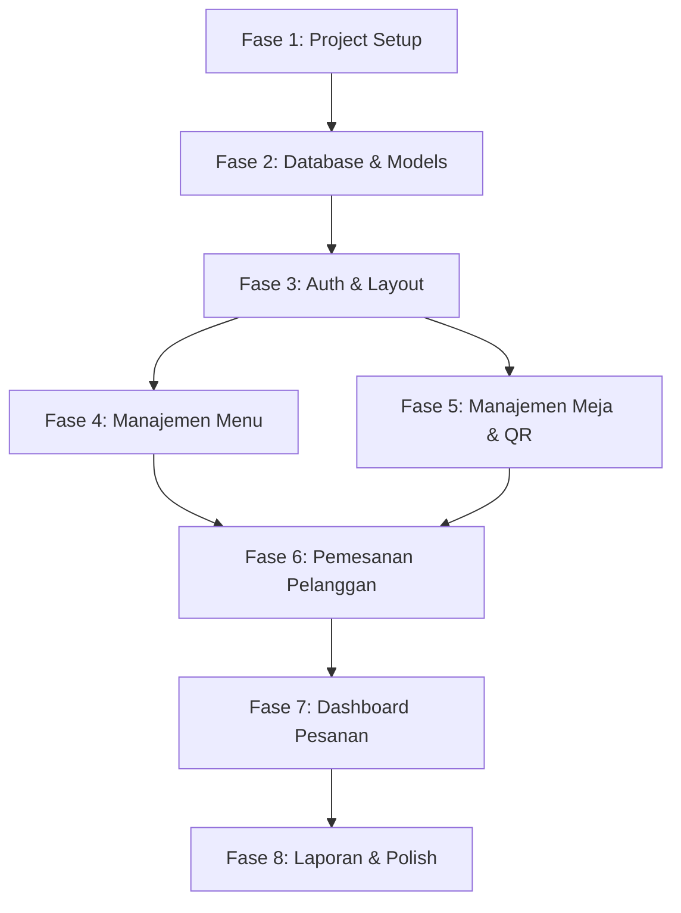

# 📋 Implementation Plan
# Sistem Pemesanan QR Code — Kopi Tempo

---

## Ringkasan

| Fase | Nama | Estimasi |
|---|---|---|
| 1 | Project Setup & Konfigurasi | 1 hari |
| 2 | Database Schema, Migration & Models | 1 hari |
| 3 | Authentication & Layout | 1 hari |
| 4 | Manajemen Menu (Dashboard) | 2 hari |
| 5 | Manajemen Meja & QR Code (Dashboard) | 1 hari |
| 6 | Sistem Pemesanan Pelanggan (Customer) | 2 hari |
| 7 | Dashboard Pesanan & Pembayaran (Dashboard) | 2 hari |
| 8 | Laporan & Polish | 2 hari |
| | **Total Estimasi** | **~12 hari** |

---

## Fase 1: Project Setup & Konfigurasi

### Tujuan
Inisialisasi project Laravel dengan React, TypeScript, Inertia.js, Tailwind CSS, dan shadcn/ui.

### Tasks

#### 1.1 Inisialisasi Project Laravel
- [ ] Buat project Laravel 11 baru
- [ ] Konfigurasi `.env` (database `kopi_tempo`, APP_NAME, APP_URL)
- [ ] Pastikan PHP 8.2+ dan MySQL 8.x tersedia
- [ ] Buat database `kopi_tempo` di MySQL

```bash
composer create-project laravel/laravel . "11.*"
```

#### 1.2 Setup Frontend Stack
- [ ] Install Inertia.js (server-side + client-side)
- [ ] Install React 18 + TypeScript
- [ ] Install Tailwind CSS
- [ ] Install shadcn/ui + dependensi (Radix UI, lucide-react, clsx, tailwind-merge)
- [ ] Konfigurasi Vite (`vite.config.ts`)
- [ ] Konfigurasi TypeScript (`tsconfig.json`)
- [ ] Konfigurasi Tailwind (`tailwind.config.ts`)
- [ ] Setup shadcn/ui (`components.json`)

```bash
# Install backend dependencies
composer require inertiajs/inertia-laravel

# Install frontend dependencies (menggunakan Bun)
bun add react react-dom @inertiajs/react
bun add -d @types/react @types/react-dom typescript
bun add -d tailwindcss postcss autoprefixer
bun add tailwind-merge clsx class-variance-authority
bun add lucide-react
bun add @radix-ui/react-slot
bun add recharts
bun add date-fns  # atau dayjs
```

#### 1.3 Setup File Dasar
- [ ] Buat `resources/views/app.blade.php` (Inertia root template)
- [ ] Buat `resources/js/app.tsx` (React entry point)
- [ ] Buat `resources/js/bootstrap.ts`
- [ ] Buat `resources/css/app.css` (Tailwind directives)
- [ ] Buat `resources/js/lib/utils.ts` (cn function, formatRupiah, constants)
- [ ] Buat `resources/js/types/models.ts` (TypeScript interfaces)
- [ ] Buat folder structure sesuai FRONTEND_GUIDELINES

#### 1.4 Install Library QR Code
- [ ] Install library QR Code PHP

```bash
composer require simplesoftwareio/simple-qrcode
```

#### 1.5 Setup Ziggy (Laravel Routes di Frontend)
- [ ] Install Ziggy

```bash
composer require tightenco/ziggy
bun add ziggy-js
```

#### 1.6 File Storage
- [ ] Jalankan `php artisan storage:link`
- [ ] Buat folder `storage/app/public/menu/`
- [ ] Buat folder `storage/app/public/qrcodes/`
- [ ] Siapkan placeholder `public/images/qris.png`
- [ ] Siapkan `public/sounds/notification.mp3`

### Acceptance Criteria
- [x] `bun run dev` berjalan tanpa error
- [x] `php artisan serve` berjalan tanpa error
- [x] Halaman test React + Inertia tampil di browser
- [x] Tailwind CSS berfungsi
- [x] shadcn/ui component bisa diimport

### File yang dibuat/dimodifikasi
```
.env
vite.config.ts
tsconfig.json
tailwind.config.ts
resources/views/app.blade.php
resources/js/app.tsx
resources/js/bootstrap.ts
resources/css/app.css
resources/js/lib/utils.ts
resources/js/lib/constants.ts
resources/js/lib/price.ts
resources/js/types/models.ts
resources/js/types/index.d.ts
public/images/qris.png (placeholder)
public/sounds/notification.mp3
```

---

## Fase 2: Database Schema, Migration & Models

### Tujuan
Membuat seluruh tabel database dan Eloquent models beserta relationships.

### Tasks

#### 2.1 Buat Migrations
- [ ] Migration: `users` (modifikasi default Laravel)
  - Hapus field `name`, `email`, `email_verified_at`, `remember_token`
  - Tambah field `username` (unique)
- [ ] Migration: `categories` (name, sort_order)
- [ ] Migration: `sub_categories` (category_id FK, name, sort_order)
- [ ] Migration: `menu_items` (category_id FK, sub_category_id FK nullable, name, price, image_path, is_available, is_best_seller, has_discount, discount_type, discount_value, sort_order)
- [ ] Migration: `variant_groups` (menu_item_id FK, name)
- [ ] Migration: `variant_options` (variant_group_id FK, name, additional_price)
- [ ] Migration: `tables` (number unique, status enum, qr_code_path)
- [ ] Migration: `orders` (order_number unique, table_id FK, status enum, payment_status enum, payment_method enum, subtotal, discount_total, tax_amount, total, cash_received nullable, cash_change nullable)
- [ ] Migration: `order_items` (order_id FK, menu_item_id FK, menu_item_name, quantity, unit_price, discount_amount, subtotal, note nullable)
- [ ] Migration: `order_item_variants` (order_item_id FK, variant_group_name, variant_option_name, additional_price)

#### 2.2 Buat Enums
- [ ] `app/Enums/OrderStatus.php` (diproses, selesai)
- [ ] `app/Enums/OrderType.php` (dine_in, takeaway)
- [ ] `app/Enums/PaymentStatus.php` (belum_bayar, menunggu_konfirmasi, sudah_bayar)
- [ ] `app/Enums/PaymentMethod.php` (cash, qris)
- [ ] `app/Enums/DiscountType.php` (percentage, fixed)
- [ ] `app/Enums/TableStatus.php` (kosong, terisi)

#### 2.3 Buat Models
- [ ] Modifikasi `User.php` (username, tanpa email)
- [ ] Buat `Category.php` (relationships: subCategories, menuItems)
- [ ] Buat `SubCategory.php` (relationships: category, menuItems)
- [ ] Buat `MenuItem.php` (relationships: category, subCategory, variantGroups, orderItems + accessor discountedPrice)
- [ ] Buat `VariantGroup.php` (relationships: menuItem, variantOptions)
- [ ] Buat `VariantOption.php` (relationships: variantGroup)
- [ ] Buat `Table.php` (relationships: orders + method hasUnpaidOrder)
- [ ] Buat `Order.php` (relationships: table, items)
- [ ] Buat `OrderItem.php` (relationships: order, menuItem, variants)
- [ ] Buat `OrderItemVariant.php` (relationships: orderItem)

#### 2.4 Buat Seeders
- [ ] `UserSeeder.php` (username: admin, password: password)
- [ ] `TableSeeder.php` (20 meja + generate QR code)
- [ ] Update `DatabaseSeeder.php`

#### 2.5 Jalankan Migration & Seeder
- [ ] `php artisan migrate`
- [ ] `php artisan db:seed`
- [ ] Verifikasi semua tabel terbuat
- [ ] Verifikasi user admin terbuat
- [ ] Verifikasi 20 meja terbuat dengan QR code

### Acceptance Criteria
- [x] Semua 10 tabel terbuat di MySQL
- [x] Semua enum values benar
- [x] Semua foreign key constraints benar
- [x] User seeder: admin/password
- [x] Table seeder: 20 meja dengan QR code images
- [x] Model relationships berfungsi (test via Tinker)

### File yang dibuat/dimodifikasi
```
database/migrations/0001_*.php ... 0010_*.php
app/Enums/OrderStatus.php
app/Enums/PaymentStatus.php
app/Enums/PaymentMethod.php
app/Enums/DiscountType.php
app/Enums/TableStatus.php
app/Models/User.php (modifikasi)
app/Models/Category.php
app/Models/SubCategory.php
app/Models/MenuItem.php
app/Models/VariantGroup.php
app/Models/VariantOption.php
app/Models/Table.php
app/Models/Order.php
app/Models/OrderItem.php
app/Models/OrderItemVariant.php
app/Services/QrCodeService.php
database/seeders/UserSeeder.php
database/seeders/TableSeeder.php
database/seeders/DatabaseSeeder.php
```

---

## Fase 3: Authentication & Layout

### Tujuan
Implementasi login kasir, layout dashboard, dan layout pelanggan.

### Tasks

#### 3.1 Authentication
- [ ] Buat `LoginController.php`
  - `create()` → render halaman login
  - `store()` → validasi username + password, login, redirect ke dashboard
  - `destroy()` → logout, redirect ke login
- [ ] Buat `LoginRequest.php` (validasi username, password required)
- [ ] Setup routes auth di `web.php`
- [ ] Setup middleware auth untuk dashboard routes

#### 3.2 Halaman Login
- [ ] Buat `resources/js/pages/auth/Login.tsx`
  - Form: username, password, tombol "Masuk"
  - Validasi error display
  - Branding "Kopi Tempo"
  - Responsive (mobile + desktop)

#### 3.3 Layout Dashboard (Desktop)
- [ ] Buat `resources/js/layouts/dashboard-layout.tsx`
  - Sidebar navigasi (fixed kiri):
    - Logo "Kopi Tempo"
    - Dashboard (Pesanan Aktif)
    - Kelola Menu → Item Menu, Kategori
    - Kelola Meja
    - Laporan → Harian, Mingguan, Bulanan, Item Terlaris, Pendapatan
    - Tombol Keluar
  - Main content area (kanan)
  - Header dengan username kasir
- [ ] Buat `resources/js/components/dashboard/sidebar.tsx`
- [ ] Buat `resources/js/components/dashboard/header.tsx`

#### 3.4 Layout Pelanggan (Mobile)
- [ ] Buat `resources/js/layouts/customer-layout.tsx`
  - Header: Logo "Kopi Tempo" + "Meja {nomor}"
  - Content area (full width, scrollable)
  - Floating cart button (pojok kanan bawah)
  - Mobile-first design

#### 3.5 HandleInertiaRequests Middleware
- [ ] Modifikasi `HandleInertiaRequests.php`
  - Share: auth.user, flash.success, flash.error

### Acceptance Criteria
- [x] Login dengan admin/password berhasil → redirect ke dashboard
- [x] Login gagal → error message tampil
- [x] Dashboard layout tampil dengan sidebar navigasi
- [x] Customer layout tampil dengan header dan floating button
- [x] Logout berfungsi → redirect ke login
- [x] Non-login user tidak bisa akses /dashboard/*

### File yang dibuat/dimodifikasi
```
app/Http/Controllers/Auth/LoginController.php
app/Http/Requests/Auth/LoginRequest.php
app/Http/Middleware/HandleInertiaRequests.php (modifikasi)
resources/js/pages/auth/Login.tsx
resources/js/layouts/dashboard-layout.tsx
resources/js/layouts/customer-layout.tsx
resources/js/components/dashboard/sidebar.tsx
resources/js/components/dashboard/header.tsx
resources/js/components/shared/app-logo.tsx
routes/web.php (modifikasi)
```

---

## Fase 4: Manajemen Menu (Dashboard)

### Tujuan
CRUD lengkap untuk kategori, sub-kategori, item menu, dan variasi dari dashboard kasir.

### Tasks

#### 4.1 Manajemen Kategori
- [ ] Buat `Dashboard\CategoryController.php` (index, create, store, edit, update, destroy)
- [ ] Buat `StoreCategoryRequest.php`
- [ ] Buat `resources/js/pages/dashboard/Categories.tsx`
  - Tabel daftar kategori (nama, jumlah item, aksi)
  - Modal tambah/edit kategori
  - Tombol hapus dengan konfirmasi
  - CRUD sub-kategori inline (accordion/nested di bawah kategori)
- [ ] Buat `Dashboard\SubCategoryController.php` (store, update, destroy)
- [ ] Buat `StoreSubCategoryRequest.php`

#### 4.2 Manajemen Item Menu
- [ ] Buat `Dashboard\MenuItemController.php` (index, create, store, edit, update, destroy, toggleAvailability, toggleBestSeller, toggleDiscount)
- [ ] Buat `StoreMenuItemRequest.php`, `UpdateMenuItemRequest.php`
- [ ] Buat `resources/js/pages/dashboard/MenuItems.tsx`
  - Tabel daftar item menu (foto thumbnail, nama, kategori, harga, status, best seller, diskon, aksi)
  - Filter berdasarkan kategori
  - Toggle switches inline: ketersediaan, best seller, diskon
- [ ] Buat `resources/js/components/dashboard/menu-form.tsx`
  - Form tambah/edit item menu
  - Upload foto (preview sebelum upload)
  - Select kategori → dynamic select sub-kategori
  - Toggle best seller & diskon
  - Jika diskon on: input tipe (persentase/nominal) + nilai

#### 4.3 Manajemen Variasi
- [ ] Buat `Dashboard\VariantGroupController.php` (store, update, destroy)
- [ ] Buat `Dashboard\VariantOptionController.php` (store, update, destroy)
- [ ] Buat `StoreVariantGroupRequest.php`, `StoreVariantOptionRequest.php`
- [ ] Buat `resources/js/components/dashboard/variant-form.tsx`
  - Section variasi di dalam form/detail item menu
  - Tambah grup variasi (nama)
  - Di bawah tiap grup: tambah opsi (nama + harga tambahan)
  - Edit & hapus grup/opsi

#### 4.4 File Upload Handler
- [ ] Implementasi upload foto menu ke `storage/app/public/menu/`
- [ ] Hapus foto lama saat update atau hapus item
- [ ] Validasi: max 2MB, format jpeg/png/webp

### Acceptance Criteria
- [x] CRUD kategori berfungsi (tambah, edit, hapus)
- [x] CRUD sub-kategori berfungsi (di bawah kategori parent)
- [x] Kategori tidak bisa dihapus jika masih ada item
- [x] CRUD item menu berfungsi (dengan upload foto)
- [x] Toggle ketersediaan, best seller, diskon langsung update
- [x] CRUD variasi grup & opsi berfungsi
- [x] Foto menu tersimpan dan bisa ditampilkan

### File yang dibuat/dimodifikasi
```
app/Http/Controllers/Dashboard/CategoryController.php
app/Http/Controllers/Dashboard/SubCategoryController.php
app/Http/Controllers/Dashboard/MenuItemController.php
app/Http/Controllers/Dashboard/VariantGroupController.php
app/Http/Controllers/Dashboard/VariantOptionController.php
app/Http/Requests/Dashboard/StoreCategoryRequest.php
app/Http/Requests/Dashboard/StoreSubCategoryRequest.php
app/Http/Requests/Dashboard/StoreMenuItemRequest.php
app/Http/Requests/Dashboard/UpdateMenuItemRequest.php
app/Http/Requests/Dashboard/StoreVariantGroupRequest.php
app/Http/Requests/Dashboard/StoreVariantOptionRequest.php
resources/js/pages/dashboard/Categories.tsx
resources/js/pages/dashboard/MenuItems.tsx
resources/js/components/dashboard/menu-form.tsx
resources/js/components/dashboard/category-form.tsx
resources/js/components/dashboard/variant-form.tsx
routes/web.php (tambah routes menu)
```

---

## Fase 5: Manajemen Meja & QR Code (Dashboard)

### Tujuan
CRUD meja, generate QR code, dan tutup meja.

### Tasks

#### 5.1 QR Code Service
- [ ] Buat `app/Services/QrCodeService.php`
  - `generate(Table $table)`: generate QR code image, simpan ke storage
  - `delete(Table $table)`: hapus QR code image
  - QR content: `{APP_URL}/meja/{number}/menu`

#### 5.2 Table Controller
- [ ] Buat `Dashboard\TableController.php`
  - `index()`: daftar semua meja
  - `store()`: tambah meja baru + generate QR
  - `destroy()`: hapus meja (hanya jika kosong) + hapus QR
  - `close()`: tutup meja (reset status ke kosong)
  - `downloadQr()`: download QR code image

#### 5.3 Halaman Meja
- [ ] Buat `resources/js/pages/dashboard/Tables.tsx`
  - Tabel: Nomor meja, Status (badge kosong/terisi), Aksi
  - Tombol "Tambah Meja" → modal input nomor meja
  - Per meja: Lihat QR | Tutup Meja | Hapus
  - Tombol hapus disabled jika meja terisi
- [ ] Buat `resources/js/components/dashboard/qr-code-modal.tsx`
  - Modal menampilkan QR code image
  - Tombol download
- [ ] Buat `resources/js/components/dashboard/table-form.tsx`

### Acceptance Criteria
- [x] Tambah meja baru → QR code otomatis ter-generate
- [x] QR code image bisa dilihat dan di-download
- [x] Hapus meja berfungsi (hanya jika kosong)
- [x] Tutup meja → status berubah ke kosong
- [x] QR code scan mengarah ke URL menu yang benar

### File yang dibuat/dimodifikasi
```
app/Services/QrCodeService.php
app/Http/Controllers/Dashboard/TableController.php
app/Http/Requests/Dashboard/StoreTableRequest.php
resources/js/pages/dashboard/Tables.tsx
resources/js/components/dashboard/qr-code-modal.tsx
resources/js/components/dashboard/table-form.tsx
routes/web.php (tambah routes meja)
```

---

## Fase 6: Sistem Pemesanan Pelanggan (Customer)

### Tujuan
Implementasi semua halaman pelanggan: menu, keranjang, checkout, pembayaran.

### Tasks

#### 6.1 Halaman Menu Pelanggan
- [ ] Buat `Customer\MenuController.php`
  - Load menu items grouped by category/sub-category
  - Load variant groups & options per item
  - Check unpaid orders → redirect jika ada
- [ ] Buat `resources/js/pages/customer/Menu.tsx`
  - Kategori tabs (scroll horizontal)
  - Grid item menu (foto, nama, harga, badge best seller/diskon)
  - Item habis: grayed out, tidak bisa diklik
  - Tap item → detail modal/sheet
- [ ] Buat `resources/js/components/customer/menu-category-tabs.tsx`
- [ ] Buat `resources/js/components/customer/menu-item-card.tsx`
- [ ] Buat `resources/js/components/customer/menu-item-detail.tsx`
  - Foto besar
  - Nama + harga
  - Pilihan variasi (radio per grup, wajib jika ada)
  - Input catatan (textarea)
  - Selector jumlah (+/-)
  - Total harga item
  - Tombol "Tambah ke Keranjang"

#### 6.2 Keranjang Pelanggan
- [ ] Buat `resources/js/hooks/use-cart.ts`
  - State: CartItem[]
  - Fungsi: addItem, removeItem, updateQuantity, clearCart
  - Persist ke localStorage (`cart_meja_{nomor}`)
  - Kalkulasi: subtotal, discount, tax, total
- [ ] Buat `resources/js/components/customer/cart-sheet.tsx`
  - Bottom sheet dengan daftar item di keranjang
  - Edit jumlah (+/-) dan hapus item
  - Ringkasan harga (subtotal, diskon, pajak 11%, total)
  - Tombol "Lanjut ke Pembayaran"
- [ ] Buat `resources/js/components/customer/cart-item.tsx`

#### 6.3 Checkout & Kirim Pesanan
- [ ] Buat `Customer\OrderController.php`
  - `checkout()`: render halaman konfirmasi
  - `store()`: validasi & simpan pesanan (via OrderService)
- [ ] Buat `StoreOrderRequest.php`
- [ ] Buat `app/Services/OrderService.php`
  - `createOrder()`: buat order + items + variants + kalkulasi harga
  - `generateOrderNumber()`: format KT-YYYYMMDD-XXXX
- [ ] Buat `resources/js/pages/customer/Checkout.tsx`
  - Ringkasan pesanan (read-only)
  - Nomor meja
  - Breakdown harga
  - Pilih metode bayar: Cash | QRIS
  - Tombol "Kirim Pesanan"
- [ ] Buat `resources/js/components/customer/order-summary.tsx`
- [ ] Buat `resources/js/components/customer/payment-method-selector.tsx`

#### 6.4 Halaman Pembayaran QRIS
- [ ] Buat `resources/js/pages/customer/Payment.tsx`
  - Tampilkan gambar QR QRIS statis
  - Total yang harus dibayar
  - Instruksi pembayaran
  - Tombol "Saya Sudah Bayar"
  - Setelah klik → halaman "Menunggu konfirmasi kasir"
- [ ] Buat `resources/js/components/customer/qris-payment-view.tsx`

#### 6.5 Halaman Sukses & Belum Bayar
- [ ] Buat `resources/js/pages/customer/Success.tsx`
  - "Pesanan Anda telah dikirim!"
  - Nomor pesanan
  - Info metode bayar (cash: "Silakan ke kasir", qris: "Menunggu konfirmasi")
- [ ] Buat `resources/js/pages/customer/Unpaid.tsx`
  - Info bahwa masih ada pesanan belum dibayar
  - Tidak bisa pesan baru
- [ ] Buat `resources/js/pages/customer/Error.tsx`
  - Halaman error untuk meja tidak ditemukan

### Acceptance Criteria
- [x] Scan QR code → halaman menu tampil dengan benar
- [x] Menu grouped by kategori, bisa scroll, tap item untuk detail
- [x] Item habis ditampilkan grayed out
- [x] Variasi bisa dipilih, mempengaruhi harga
- [x] Keranjang berfungsi (tambah, hapus, ubah jumlah)
- [x] Keranjang persist di localStorage
- [x] Checkout menampilkan ringkasan + pilih metode bayar benar
- [x] Pesanan tersimpan di database dengan data yang benar
- [x] QRIS flow: tampil QR → klik sudah bayar → menunggu konfirmasi
- [x] Cash flow: pesanan masuk sebagai "belum bayar"
- [x] Jika ada pesanan belum bayar → redirect ke halaman unpaid
- [x] Kalkulasi harga benar (subtotal, diskon, pajak 11%, total)

### File yang dibuat/dimodifikasi
```
app/Http/Controllers/Customer/MenuController.php
app/Http/Controllers/Customer/OrderController.php
app/Http/Requests/Customer/StoreOrderRequest.php
app/Services/OrderService.php
resources/js/hooks/use-cart.ts
resources/js/pages/customer/Menu.tsx
resources/js/pages/customer/Checkout.tsx
resources/js/pages/customer/Payment.tsx
resources/js/pages/customer/Success.tsx
resources/js/pages/customer/Unpaid.tsx
resources/js/pages/customer/Error.tsx
resources/js/components/customer/menu-category-tabs.tsx
resources/js/components/customer/menu-item-card.tsx
resources/js/components/customer/menu-item-detail.tsx
resources/js/components/customer/cart-sheet.tsx
resources/js/components/customer/cart-item.tsx
resources/js/components/customer/order-summary.tsx
resources/js/components/customer/payment-method-selector.tsx
resources/js/components/customer/qris-payment-view.tsx
routes/web.php (tambah routes customer)
```

---

## Fase 7: Dashboard Pesanan & Pembayaran (Dashboard)

### Tujuan
Implementasi halaman pesanan aktif dengan polling, konfirmasi pembayaran, dan ubah status pesanan.

### Tasks

#### 7.1 Dashboard Pesanan Aktif
- [ ] Buat `Dashboard\DashboardController.php`
  - `index()`: load pesanan aktif (status: diproses) with eager loading
- [ ] Buat `Dashboard\OrderController.php`
  - `createTakeaway()`: render halaman pemesanan takeaway baru
  - `storeTakeaway()`: hitung total dan simpan pesanan takeaway + proses bayar
  - `polling()`: return data pesanan terbaru (untuk partial reload)
  - `updateStatus()`: ubah status pesanan (diproses → selesai)
  - `destroy()`: hapus pesanan
- [ ] Buat `resources/js/pages/dashboard/Orders.tsx`
  - Grid/list kartu pesanan aktif (menampilkan label Dine-in atau Takeaway)
  - Tombol: Proses Pembayaran | Selesai | Hapus
  - Tombol utama: "Buat Takeaway Baru"
- [ ] Buat `resources/js/pages/dashboard/TakeawayCreate.tsx`
  - Antarmuka POS sederhana untuk memilih item, variasi, dan catatan khusus
  - Ringkasan pesanan & Pilih pembayaran (Cash/QRIS)

#### 7.2 Polling & Notifikasi
- [ ] Buat `resources/js/hooks/use-polling.ts`
  - `setInterval` setiap 10 detik
  - Gunakan Inertia partial reload: `router.reload({ only: ['orders'] })`
  - Deteksi pesanan baru (bandingkan ID)
- [ ] Buat `resources/js/hooks/use-notification.ts`
  - Play audio saat pesanan baru
  - Show toast notification (shadcn/ui toast)
- [ ] Buat `resources/js/components/dashboard/notification-popup.tsx`
- [ ] Siapkan file audio `public/sounds/notification.mp3`

#### 7.3 Konfirmasi Pembayaran
- [ ] Buat `Dashboard\PaymentController.php`
  - `processCash()`: input cash_received, hitung kembalian, update payment_status
  - `confirmQris()`: update payment_status ke sudah_bayar
- [ ] Buat `ProcessPaymentRequest.php`
- [ ] Buat `resources/js/components/dashboard/payment-cash-modal.tsx`
  - Total tagihan
  - Input nominal uang diterima
  - Kalkulasi kembalian otomatis
  - Tombol "Konfirmasi Pembayaran"
- [ ] Buat `resources/js/components/dashboard/payment-qris-modal.tsx`
  - Info pesanan
  - Tombol "Konfirmasi Pembayaran QRIS"
- [ ] Buat `resources/js/components/dashboard/order-card.tsx`
- [ ] Buat `resources/js/components/dashboard/order-detail-modal.tsx`

#### 7.4 Ubah Status & Hapus Pesanan
- [ ] Tombol "Selesai" → update status pesanan ke selesai → hilang dari daftar aktif
- [ ] Tombol "Hapus" → konfirmasi dialog → hapus pesanan
- [ ] Saat pesanan terakhir di meja selesai/dihapus → update status meja jika tidak ada pesanan aktif lain

### Acceptance Criteria
- [x] Dashboard menampilkan pesanan aktif real-time (polling 10 detik)
- [x] Notifikasi suara + popup muncul saat ada pesanan baru
- [x] Konfirmasi pembayaran cash: input nominal, hitung kembalian
- [x] Konfirmasi pembayaran QRIS: satu klik konfirmasi
- [x] Ubah status pesanan: Diproses → Selesai berfungsi
- [x] Hapus pesanan berfungsi dengan konfirmasi
- [x] Setelah pembayaran dikonfirmasi, pelanggan bisa pesan lagi

### File yang dibuat/dimodifikasi
```
app/Http/Controllers/Dashboard/DashboardController.php
app/Http/Controllers/Dashboard/OrderController.php
app/Http/Controllers/Dashboard/PaymentController.php
app/Http/Requests/Dashboard/ProcessPaymentRequest.php
app/Services/PaymentService.php
resources/js/hooks/use-polling.ts
resources/js/hooks/use-notification.ts
resources/js/pages/dashboard/Orders.tsx
resources/js/components/dashboard/order-card.tsx
resources/js/components/dashboard/order-detail-modal.tsx
resources/js/components/dashboard/payment-cash-modal.tsx
resources/js/components/dashboard/payment-qris-modal.tsx
resources/js/components/dashboard/notification-popup.tsx
resources/js/pages/dashboard/TakeawayCreate.tsx
public/sounds/notification.mp3
routes/web.php (tambah routes pesanan & pembayaran)
```

---

## Fase 8: Laporan & Polish

### Tujuan
Implementasi semua halaman laporan dan finishing touches.

### Tasks

#### 8.1 Report Service
- [ ] Buat `app/Services/ReportService.php`
  - `dailySales($date)`: pesanan per hari, total revenue
  - `weeklySales($startDate)`: aggregasi per hari dalam seminggu
  - `monthlySales($year, $month)`: aggregasi per hari/minggu dalam sebulan
  - `topItems($startDate, $endDate, $limit)`: ranking item terlaris
  - `revenue($startDate, $endDate)`: total revenue + breakdown cash vs QRIS

#### 8.2 Report Controller & Pages
- [ ] Buat `Dashboard\ReportController.php`
  - `daily()`, `weekly()`, `monthly()`, `topItems()`, `revenue()`
- [ ] Buat `resources/js/pages/dashboard/ReportDaily.tsx`
  - Date picker
  - Tabel pesanan hari itu
  - Total penjualan & jumlah transaksi
- [ ] Buat `resources/js/pages/dashboard/ReportWeekly.tsx`
  - Week picker
  - Bar chart penjualan per hari
  - Total minggu
- [ ] Buat `resources/js/pages/dashboard/ReportMonthly.tsx`
  - Month/year picker
  - Line chart penjualan per hari
  - Total bulan
- [ ] Buat `resources/js/pages/dashboard/ReportTopItems.tsx`
  - Period picker
  - Ranking tabel: nama item, jumlah terjual, revenue
- [ ] Buat `resources/js/pages/dashboard/ReportRevenue.tsx`
  - Custom date range picker
  - Total revenue
  - Breakdown: Cash vs QRIS (pie chart / bar chart)
- [ ] Buat `resources/js/components/dashboard/report-chart.tsx`
  - Wrapper component untuk Recharts

#### 8.3 Polish & Testing
- [ ] Review semua halaman pelanggan di perangkat mobile
- [ ] Review semua halaman kasir di desktop
- [ ] Pastikan semua validasi berfungsi (frontend + backend)
- [ ] Pastikan semua error handling berfungsi (404, 422, 500)
- [ ] Pastikan semua flash messages tampil (sukses, error)
- [ ] Pastikan kalkulasi harga konsisten (frontend = backend)
- [ ] Test flow lengkap:
  - [ ] Scan QR → lihat menu → pesan → bayar cash → kasir konfirmasi → selesai
  - [ ] Scan QR → lihat menu → pesan → bayar QRIS → pelanggan konfirmasi → kasir konfirmasi → selesai
  - [ ] Multi-order dari meja yang sama
  - [ ] Pesanan belum bayar → tidak bisa pesan lagi
- [ ] Optimasi loading (lazy load gambar, skeleton loading)
- [ ] Pastikan audio notifikasi berfungsi
- [ ] Set `<html lang="id">` di blade template

### Acceptance Criteria
- [x] Laporan harian, mingguan, bulanan tampil dengan benar
- [x] Chart/grafik render dengan data yang akurat
- [x] Item terlaris ranking benar
- [x] Revenue breakdown cash vs QRIS akurat
- [x] Semua flow end-to-end berfungsi tanpa error
- [x] Perangkat mobile: halaman pelanggan responsive
- [x] Desktop: dashboard kasir responsive

### File yang dibuat/dimodifikasi
```
app/Services/ReportService.php
app/Http/Controllers/Dashboard/ReportController.php
resources/js/pages/dashboard/ReportDaily.tsx
resources/js/pages/dashboard/ReportWeekly.tsx
resources/js/pages/dashboard/ReportMonthly.tsx
resources/js/pages/dashboard/ReportTopItems.tsx
resources/js/pages/dashboard/ReportRevenue.tsx
resources/js/components/dashboard/report-chart.tsx
routes/web.php (tambah routes laporan)
```

---

## Urutan Dependensi Antar Fase



> **Fase 4 dan 5 bisa dikerjakan paralel** karena tidak saling bergantung. Sisanya harus sequential.

---

## Checklist Ringkas

- [ ] **Fase 1:** Project setup, install semua dependencies
- [ ] **Fase 2:** 10 migrations, 5 enums, 10 models, 2 seeders
- [ ] **Fase 3:** Login page, dashboard layout, customer layout
- [ ] **Fase 4:** CRUD kategori, sub-kategori, item menu, variasi
- [ ] **Fase 5:** CRUD meja, QR generation, tutup meja
- [ ] **Fase 6:** Menu pelanggan, keranjang, checkout, pembayaran
- [ ] **Fase 7:** Dashboard pesanan, polling, notifikasi, konfirmasi bayar
- [ ] **Fase 8:** 5 halaman laporan + charts, testing end-to-end
