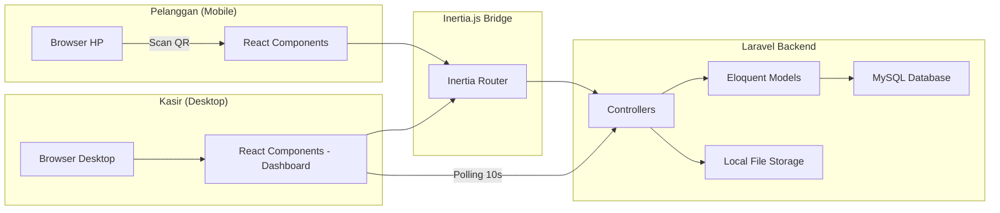

# 🛠️ Tech Stack
# Sistem Pemesanan QR Code — Kopi Tempo

---

## 1. Ringkasan Tech Stack

| Layer | Teknologi | Versi |
|---|---|---|
| **Backend Framework** | Laravel | 11.x |
| **Frontend Framework** | React | 18.x |
| **Language (Frontend)** | TypeScript | 5.x |
| **Frontend-Backend Bridge** | Inertia.js | 2.x |
| **CSS Framework** | Tailwind CSS | 3.x |
| **UI Component Library** | shadcn/ui | latest |
| **Database** | MySQL | 8.x |
| **Package Manager / Runtime** | Bun | latest |
| **Web Server (Dev)** | Laravel built-in server | - |
| **Real-time** | HTTP Polling | - |

---

## 2. Backend

### 2.1 Laravel 11

- **Peran:** Backend framework utama, menangani routing, controller, model, migration, seeding, authentication, storage, dan API.
- **Alasan pemilihan:** Framework PHP paling populer dengan ekosistem yang matang, cocok untuk aplikasi CRUD dengan autentikasi.

**Fitur Laravel yang akan digunakan:**
- **Eloquent ORM** — Untuk interaksi database (models, relationships, query builder)
- **Migration & Seeder** — Untuk schema database dan data awal
- **Authentication** — Session-based auth untuk kasir (menggunakan Laravel built-in)
- **File Storage** — Local disk untuk upload foto menu
- **Validation** — Server-side validation untuk semua request
- **Middleware** — Auth middleware untuk melindungi halaman kasir
- **Resource Controllers** — Untuk CRUD operations yang terstruktur

### 2.2 MySQL 8.x

- **Peran:** Database relasional utama
- **Alasan pemilihan:** Database relasional yang solid, cocok untuk data transaksi (pesanan, pembayaran)
- **Charset:** utf8mb4
- **Collation:** utf8mb4_unicode_ci

---

## 3. Frontend

### 3.1 React 18 + TypeScript

- **Peran:** Library UI untuk membangun antarmuka interaktif
- **TypeScript:** Type safety untuk mencegah runtime errors dan meningkatkan developer experience
- **Alasan pemilihan:** Ekosistem React yang luas, kompatibilitas baik dengan Inertia.js dan shadcn/ui

### 3.2 Inertia.js 2.x

- **Peran:** Bridge antara Laravel (backend) dan React (frontend)
- **Alasan pemilihan:** Memungkinkan membangun SPA-like experience tanpa perlu membuat API terpisah. Data dikirim dari Laravel controller langsung ke React component sebagai props.

**Cara kerja Inertia.js dalam proyek ini:**
```
Laravel Controller → return Inertia::render('PageComponent', $data)
                   → React menerima $data sebagai props
                   → Navigasi antar halaman tanpa full-page reload
```

**Penggunaan khusus:**
- Halaman kasir/admin: Full Inertia.js flow (server-side routing + React rendering)
- Halaman pelanggan: Juga menggunakan Inertia.js (routing di Laravel, rendering di React)

### 3.3 Tailwind CSS 3.x

- **Peran:** Utility-first CSS framework untuk styling
- **Alasan pemilihan:** Cepat dalam development, konsisten, dan terintegrasi baik dengan shadcn/ui
- **Konfigurasi:** Akan disesuaikan tema warna oleh user kemudian

### 3.4 shadcn/ui

- **Peran:** Component library yang di-copy ke project (bukan dependency)
- **Alasan pemilihan:** Komponen UI yang accessible, themeable, dan berbasis Radix UI
- **Komponen yang akan digunakan:**
  - `Button`, `Input`, `Label`, `Select`
  - `Card`, `Table`, `Badge`
  - `Dialog` (Modal)
  - `Sheet` (untuk mobile slide-up panel)
  - `Tabs`, `Separator`
  - `Toast` (untuk notifikasi)
  - `Switch` / `Toggle` (untuk on/off)
  - `DropdownMenu`
  - `AlertDialog` (konfirmasi hapus)
  - `Skeleton` (loading state)

---

## 4. Development Tools

### 4.1 Bun

- **Peran:** Package manager dan JavaScript runtime
- **Digunakan untuk:**
  - Install dependencies (`bun install`)
  - Menjalankan dev server frontend (`bun run dev`)
  - Build production bundle (`bun run build`)
- **Alasan pemilihan:** Lebih cepat dari npm/yarn

### 4.2 Vite

- **Peran:** Build tool dan dev server untuk frontend (diintegrasikan oleh Laravel melalui `laravel-vite-plugin`)
- **Alasan:** Default bundler untuk Laravel + React stack

---

## 5. Library Pendukung

### 5.1 QR Code Generation

| Library | Peran |
|---|---|
| `chillerlan/php-qrcode` atau `simplesoftwareio/simple-qrcode` | Generate QR Code image di server (PHP/Laravel) |

- QR Code di-generate saat meja dibuat
- QR Code berisi URL: `{APP_URL}/meja/{nomor_meja}/menu`
- QR Code disimpan sebagai image file di local storage
- QR Code bisa di-download oleh kasir dari dashboard

### 5.2 Chart / Grafik (Laporan)

| Library | Peran |
|---|---|
| `recharts` | Library chart untuk React — menampilkan grafik penjualan di halaman laporan |

- Digunakan di halaman laporan kasir untuk visualisasi:
  - Bar chart: Penjualan per hari/minggu
  - Line chart: Trend penjualan
  - Ranking chart: Item terlaris

### 5.3 Lainnya

| Library | Peran |
|---|---|
| `@inertiajs/react` | Inertia.js adapter untuk React |
| `laravel-vite-plugin` | Integrasi Vite dengan Laravel |
| `ziggy-js` | Menggunakan Laravel named routes di frontend React |
| `lucide-react` | Icon library (digunakan oleh shadcn/ui) |
| `clsx` + `tailwind-merge` | Utility untuk conditional classnames (digunakan oleh shadcn/ui) |
| `date-fns` atau `dayjs` | Library untuk manipulasi tanggal di frontend |

---

## 6. Arsitektur Real-time (Polling)

### Mekanisme

- **Metode:** HTTP Polling setiap **10 detik**
- **BUKAN** WebSocket / Pusher / SSE

### Implementasi

```
Frontend (React):
  setInterval(() => {
    // Fetch data pesanan terbaru dari server
    router.reload({ only: ['orders'] })  // Inertia partial reload
  }, 10000)  // 10 detik
```

### Notifikasi Pesanan Baru

- Saat polling mendeteksi pesanan baru (ID yang belum pernah dilihat):
  - **Suara:** Play audio notifikasi di browser
  - **Pop-up:** Toast notification dari shadcn/ui

---

## 7. File Storage

### Foto Menu

| Aspek | Detail |
|---|---|
| Storage | **Local filesystem** (Laravel `storage/app/public`) |
| Akses publik | Melalui symbolic link (`php artisan storage:link`) |
| URL | `/storage/menu/{filename}` |
| Format | JPG, PNG, WebP |
| Max size | Akan ditentukan (rekomendasi: 2MB) |

### QR Code Images

| Aspek | Detail |
|---|---|
| Storage | **Local filesystem** (Laravel `storage/app/public`) |
| Lokasi | `/storage/qrcodes/{nomor_meja}.png` |
| Generate | Saat meja dibuat |
| Akses | Download melalui dashboard kasir |

---

## 8. Authentication

| Aspek | Detail |
|---|---|
| Metode | **Session-based** (Laravel default) |
| Guard | `web` |
| Login | Username + Password |
| Jumlah akun | 1 akun kasir/admin |
| Registrasi | **Tidak ada** (akun dibuat via seeder) |
| Remember me | Opsional |
| CSRF Protection | ✅ (Laravel default) |

---

## 9. Deployment (TBD)

Deployment belum ditentukan. Sistem akan di-develop untuk bisa berjalan di environment standard:
- PHP 8.2+
- MySQL 8.x
- Composer
- Bun
- Node.js (jika diperlukan oleh beberapa tools)

---

## 10. Arsitektur Tingkat Tinggi


